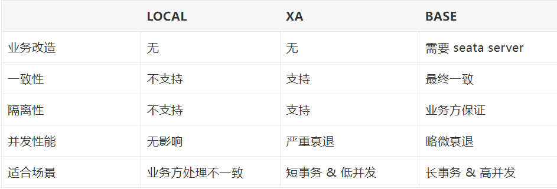
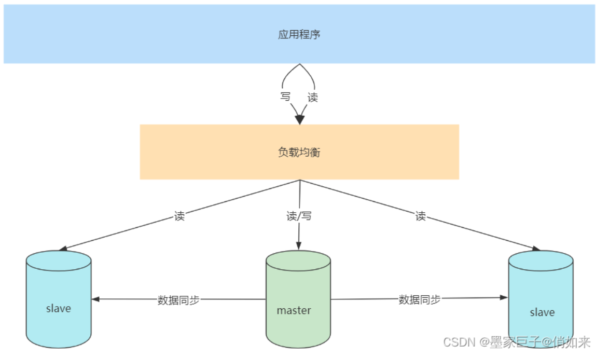

# Sharding-JDBC

## yaml 配置

~~~yaml
spring:
  shardingsphere:
    datasource:
      names: sharding-1,sharding-2 # 数据源名
      sharding-1:
        type: com.zaxxer.hikari.HikariDataSource # type不能为空
        driver-class-name: com.mysql.cj.jdbc.Driver
        username: #username
        password: #password
        jdbc-url: #连接字符串
      sharding-2:
        type: com.zaxxer.hikari.HikariDataSource # type不能为空
        driver-class-name: com.mysql.cj.jdbc.Driver
        username: #username
        password: #password
        jdbc-url: #连接字符串
    sharding:
      tables:
        # 设置order表的规则
        t_order:
          # 设置order表名的规则
          actualDataNodes: sharding-$->{1..2}.order_$->{0..1}
          # 设置分片策略
          tableStrategy:
            inline: # 设置分片键和算法
              shardingColumn: id
              algorithmExpression: order_$->{id % 2}
          # 指定order表的主键字段和生成策略
          keyGenerator:
            column: id
            type: SNOWFLAKE
    # 开启日志
    props:
      sql:
        show: true
~~~

#### 注意

- 需要关闭默认的数据源

  ~~~java
  @SpringBootApplication(exclude = {DataSourceAutoConfiguration.class})
  ~~~

  

## Java 配置

~~~java
package cn.vincent.config;

import com.baomidou.mybatisplus.extension.spring.MybatisSqlSessionFactoryBean;
import com.zaxxer.hikari.HikariDataSource;
import org.apache.ibatis.session.SqlSessionFactory;
import org.apache.shardingsphere.api.config.sharding.KeyGeneratorConfiguration;
import org.apache.shardingsphere.api.config.sharding.ShardingRuleConfiguration;
import org.apache.shardingsphere.api.config.sharding.TableRuleConfiguration;
import org.apache.shardingsphere.api.config.sharding.strategy.InlineShardingStrategyConfiguration;
import org.apache.shardingsphere.api.config.sharding.strategy.ShardingStrategyConfiguration;
import org.apache.shardingsphere.core.rule.ShardingRule;
import org.apache.shardingsphere.shardingjdbc.jdbc.core.datasource.ShardingDataSource;
import org.mybatis.spring.annotation.MapperScan;
import org.springframework.beans.factory.annotation.Value;
import org.springframework.context.annotation.Bean;
import org.springframework.context.annotation.Configuration;
import org.springframework.context.annotation.Primary;

import javax.sql.DataSource;
import java.sql.SQLException;
import java.util.*;

@Configuration
@MapperScan(basePackages = "cn.vincent.dao.mapper")
public class ShardingJdbcConfig {

    @Bean
    @Primary
    public SqlSessionFactory sqlSessionFactory() throws Exception {
        MybatisSqlSessionFactoryBean factoryBean = new MybatisSqlSessionFactoryBean();
        factoryBean.setDataSource(dataSource());
        return factoryBean.getObject();
    }

    /**
     * 设置sharding数据源
     *
     * @return
     * @throws SQLException
     */
    @Bean
    @Primary
    public DataSource dataSource() throws SQLException {
        Properties properties = new Properties();
        // 开启日志
        properties.setProperty("sql.show", "true");
        // 创建sharding数据源 参数是数据源Map、分片策略对象、配置属性
        ShardingDataSource shardingDataSource = new ShardingDataSource(dataSourceMap(), shardingRule(), properties);
        return shardingDataSource;
    }

    //region 分片策略
    private ShardingRule shardingRule() {
        ShardingRuleConfiguration shardingRuleConfiguration = new ShardingRuleConfiguration();
        shardingRuleConfiguration.setTableRuleConfigs(tableRuleConfigurations());
        ShardingRule shardingRule = new ShardingRule(shardingRuleConfiguration, dataSourceNames());
        return shardingRule;
    }

    private Collection<TableRuleConfiguration> tableRuleConfigurations() {
        ArrayList<TableRuleConfiguration> configurations = new ArrayList<TableRuleConfiguration>();

        //region order表
        //创建表分片策略对象 TableRuleConfiguration 设置逻辑表名 和 表名规则
        TableRuleConfiguration t_order =
                new TableRuleConfiguration("t_order", "sharding-$->{1..2}.order_$->{0..1}");

        //设置分表策略 分片键和算法
        ShardingStrategyConfiguration shardingTableStrategy =
                new InlineShardingStrategyConfiguration("id", "order_$->{id % 2}");
        //设置分库策略 分片键和算法
        ShardingStrategyConfiguration shardingDatabaseStrategy =
                new InlineShardingStrategyConfiguration("id", "sharding-$->{id % 2 + 1}");
        //指定order表的主键字段和生成策略
        KeyGeneratorConfiguration keyGeneratorConfiguration = new KeyGeneratorConfiguration("SNOWFLAKE", "id");

        t_order.setTableShardingStrategyConfig(shardingTableStrategy);
        t_order.setDatabaseShardingStrategyConfig(shardingDatabaseStrategy);
        t_order.setKeyGeneratorConfig(keyGeneratorConfiguration);
        configurations.add(t_order);
        //endregion

        return configurations;
    }
    //endregion

    //region 数据源
    private Collection<String> dataSourceNames() {
        List<String> list = new ArrayList<String>() {
            {
                add("sharding-1");
                add("sharding-2");
            }
        };
        return list;
    }

    private Map<String, DataSource> dataSourceMap() {
        Map<String, DataSource> dataSourceMap = new HashMap<String, DataSource>() {
            {
                put("sharding-1", sharding_1());
                put("sharding-2", sharding_2());
            }
        };
        return dataSourceMap;
    }

    @Value("${datasource.sharding-1.username}")
    private String username_1;
    @Value("${datasource.sharding-1.password}")
    private String password_1;
    @Value("${datasource.sharding-1.jdbc-url}")
    private String url_1;
    @Value("${datasource.sharding-1.driver-class-name}")
    private String driverClassName_1;

    private DataSource sharding_1() {
        HikariDataSource hikari = new HikariDataSource();
        hikari.setDriverClassName(driverClassName_1);
        hikari.setJdbcUrl(url_1);
        hikari.setUsername(username_1);
        hikari.setPassword(password_1);
        return hikari;
    }

    @Value("${datasource.sharding-2.username}")
    private String username_2;
    @Value("${datasource.sharding-2.password}")
    private String password_2;
    @Value("${datasource.sharding-2.jdbc-url}")
    private String url_2;
    @Value("${datasource.sharding-2.driver-class-name}")
    private String driverClassName_2;

    private DataSource sharding_2() {
        HikariDataSource hikari = new HikariDataSource();
        hikari.setDriverClassName(driverClassName_2);
        hikari.setJdbcUrl(url_2);
        hikari.setUsername(username_2);
        hikari.setPassword(password_2);
        return hikari;
    }
    //endregion
}
~~~

对应的yaml文件

~~~yaml
datasource:
  sharding-1:
    driver-class-name: com.mysql.cj.jdbc.Driver
    username: #username
    password: #password
    jdbc-url: #连接字符串
  sharding-2:
    driver-class-name: com.mysql.cj.jdbc.Driver
    username: #username
    password: #password
    jdbc-url: #连接字符串
~~~

#### 注意

- 配置类的方式需要注意

  ~~~java
  @SpringBootApplication(exclude = {
          DataSourceAutoConfiguration.class,
          SpringBootConfiguration.class
  })
  // 要剔除org.apache.shardingsphere.shardingjdbc.spring.boot.SpringBootConfiguration.class
  // 不剔除的话数据源的注入会失败
  ~~~

## 数据分片 - 概念

[官网 - 参考地址](https://shardingsphere.apache.org/document/current/cn/features/sharding/concept/)

表概念：

- 逻辑表：相同结构的水平拆分数据库（表）的逻辑名称
  例如：t_order_0 到 t_order_9，他们的逻辑表名可以是 t_order
- 真实表：实际存在的物理表
- 绑定表：分片规则一致的一组分片表 这样的表使用关联查询的时候效率更高
- 广播表：指所有的数据源中都存在的表，表结构及其数据在每个数据库中均完全一致。 
  适用于数据量不大且需要与海量数据的表进行关联查询的场景，例如：字典表。
- 单表：指所有的分片数据源中仅唯一存在的表  适用于数据量不大且无需分片的表

分片概念：

- 分片键：
  用于将数据库（表）水平拆分的数据库字段
  例：将订单表中的订单主键的尾数取模分片，则订单主键为分片字段。 SQL 中如果无分片字段，将执行全路由，性能较差。 
  除了对单分片字段的支持 Apache ShardingSphere 也支持根据**多个字段进行分片**
- 分片算法：
  用于将数据分片的算法，支持 `=`、`>=`、`<=`、`>`、`<`、`BETWEEN` 和 `IN` 进行分片
  分片算法可由开发者自行实现 也可使用 Apache ShardingSphere 内置的分片算法语法糖 灵活度非常高
- 行表达式：
  行表达式的内容使用的是 Groovy 的语法
   `${ expression }` 或 `$->{ expression }`
  `${begin..end}` 表示范围区间 `${[unit1, unit2, unit_x]}` 表示枚举值

## 分布式事务

ShardingSphere 对外提供 begin/commit/rollback 传统事务接口
通过 **LOCAL**，**XA**，**BASE** 三种模式提供了分布式事务的能力

#### LOCAL 模式

LOCAL 模式ShardingSphere通过 `begin` 指令在每个被代理的数据库开启事务 执行实际SQL 并执行 commit/rollback
由于每个数据节点各自管理自己的事务，它们之间没有协调以及通信的能力，也并不互相知晓其他数据节点事务的成功与否。 **在性能方面无任何损耗**，**但在强一致性以及最终一致性方面不能够保证**。

#### XA 模式

XA 事务采用的是 X/OPEN 组织所定义的 DTP 模型
XA 事务抽象出AP（应用程序）、 TM（事务管理器）、 RM（资源管理器） 概念来保证分布式事务的强一致性

其中 TM 与 RM 间采用 XA 的协议进行双向通信，通过**两阶段提交实现**。 
与传统的本地事务相比，XA 事务增加了准备阶段，数据库除了被动接受提交指令外，还可以反向通知调用方事务是否可以被提交。TM可以收集所有分支事务的准备结果，并于最后进行原子提交，以保证事务的强一致性。

XA 事务建立在 ShardingSphere 代理的数据库 xa start/end/prepare/commit/rollback/recover 的接口上

对于一条逻辑SQL，ShardingSphere 通过xa begin指令在每个被代理的数据库开启事务，内部集成TM，用于协调各分支事务，并执行 xa commit/rollback。

基于 XA 协议实现的分布式事务，由于在执行的过程中需要对所需资源进行锁定，它**更加适用于执行时间确定的短事务**。 对于长事务来说，整个事务进行期间对数据的独占，将会对并发场景下的性能产生一定的影响。

#### BASE 模式

BASE模式 是柔性事务
在 ACID 事务中对隔离性的要求很高  在事务执行过程中  必须将所有的资源锁定
柔性事务则是通过业务逻辑将互斥锁操作从资源层面上移至业务层面 通过放宽对强一致性要求 来提升系统吞吐量
 Apache ShardingSphere 集成了 **SEATA** 作为柔性事务的使用方案

三种模式对比：

## 读写分离

#### MySQL 读写分离

1. 将Master的binary-log日志文件打开，mysql会把所有的DDL,DML,TCL写入BinaryLog日志文件中
2. Master会生成一个 log dump 线程，用来给从库的 i/o线程传binlog
3. 从库的i/o线程去请求主库的binlog，并将得到的binlog日志写到中继日志（relaylog）中
4. 从库的sql线程，会读取relaylog文件中的日志，并解析成具体操作，通过主从的操作一致，而达到最终数据一致

## 数据库网关

## 数据迁移

